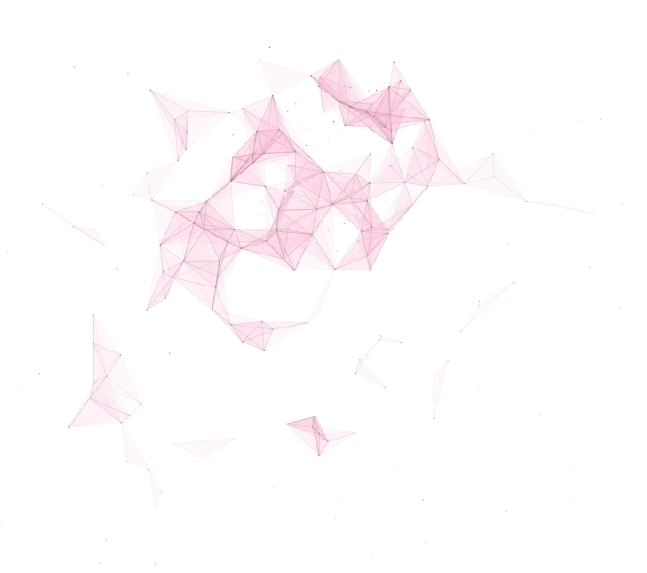
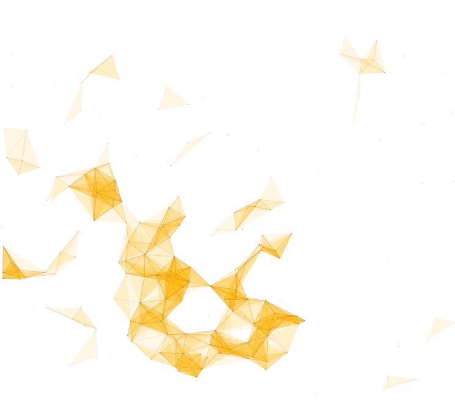
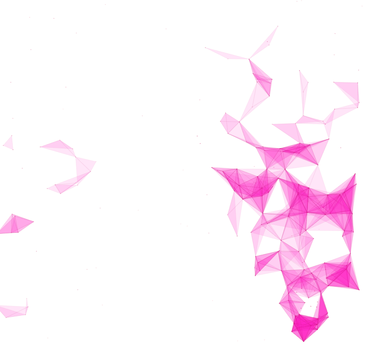
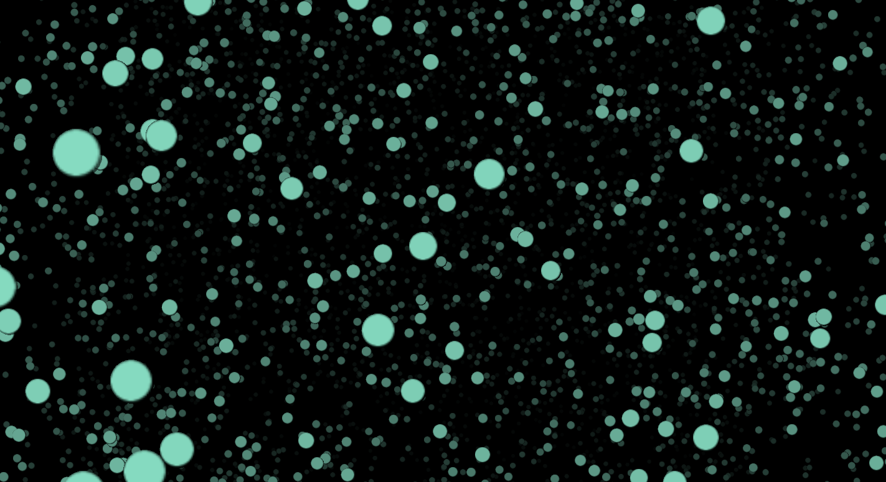
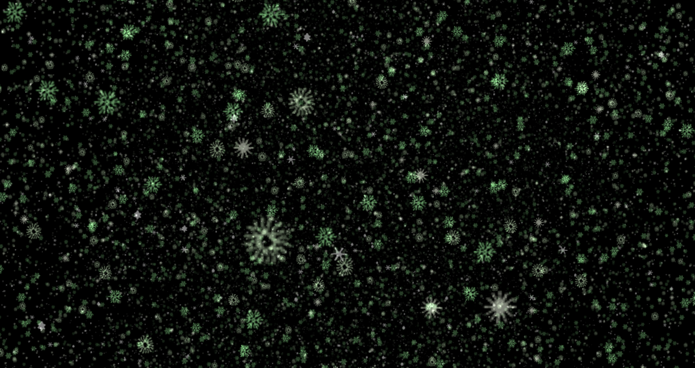
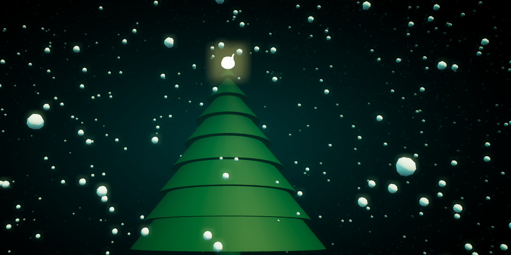

# qcui0299_9103_tut1
## Part 1: Imaging Technique Inspiration
### Explanation
- I'm inspired by the use of particle systems and their triangle formations. Every frame was so beautiful while watching this case, I want to incorporate the dynamic connection of particles into my projects. This technique allows particles to form geometric shapes, creating visually engaging experiences. So I think this approach allows my projects to achieve an organic, fluid aesthetic that aligns with the assignment's emphasis on interactivity and visual flow. Dynamic visual elements enhance the overall design and make it more engaging. This approach adds depth and movement to my visual narratives, making my work more interesting and surprising.
### Images to illustrate chosen example
 ### Image 1
 - 
  ### Image 2
 - 
  ### Image 3
 - 
 ## Part 2: Coding Technique Exploration
 ## Explanation
 ### Coding Technique: Particle Systems 
  - This coding technique, using particle systems, helps create dynamic, evolving visual effects by simulating small units (particles) that follow certain behaviors. For instance, in the triangle trail effect, each particle interacts with others to form triangular shapes, mimicking natural movement like a flock of birds or a school of fish. This technique allows for randomness and flexibility, ensuring that the design feels organic and ever-changing. For my project, this is useful because it adds an element of unpredictability and aesthetic complexity while remaining relatively easy to implement with tools like p5.js.
 ## image showcasing the coding technique in action
 ### Points/ billboards
  - 
  - [Example Linkilibil](https://github.com/mrdoob/three.js/blob/master/examples/webgl_points_billboards.html);
 ### Points/ sprites
  - 
  - [Example Link](https://github.com/mrdoob/three.js/blob/master/examples/webgl_points_sprites.html);
 ### Points/ snow
  - 
  - [Example Link](https://github.com/mrdoob/three.js/blob/master/examples/webgpu_compute_particles_snow.html);

